# prak_flutter_jb06

## Practical 1: Building a Layout in Flutter

### Step 1: Create a New Project
Create a new Flutter project named layout_flutter . Or customize the style of your lab report.


### Step 2: Open the filelib/main.dart
Open the file main.dartand replace it with the following code. Enter your name and student ID number in the text title.


### Step 3: Identify the diagram layout
The first step is to break down the layout into its basic elements:

Identify rows and columns.
Does the layout include a grid?
Are there any overlapping elements?
Does the UI need tabs?
Pay attention to areas that require alignment, padding, or borders.
First, identify the larger elements. In this example, four elements are arranged in a column: an image, two rows, and a block of text.

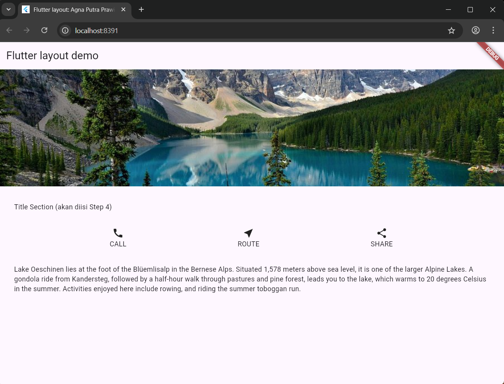

Step 4: Implement the title row
First, you'll create the left column for the title. Add the following code at the top of the method build()inside the class MyApp:
```dart:
 // 🔹 Title Section 
    Widget titleSection = Container(
      padding: const EdgeInsets.all(32),
      child: Row(
        children: [
          Expanded(
            // soal 1: Column dibungkus Expanded + crossAxisAlignment.start
            child: Column(
              crossAxisAlignment: CrossAxisAlignment.start,
              children: [
                // soal 2: Tambah padding bottom 8 + teks bold
                Container(
                  padding: const EdgeInsets.only(bottom: 8),
                  child: const Text(
                    'Wisata Gunung di Batu',
                    style: TextStyle(
                      fontWeight: FontWeight.bold,
                    ),
                  ),
                ),
                // soal 2: teks kedua warna abu-abu
                Text(
                  'Batu, Malang, Indonesia',
                  style: TextStyle(
                    color: Colors.grey[500],
                  ),
                ),
              ],
            ),
          ),
          // soal 3: icon bintang merah + angka 41
          const Icon(
            Icons.star,
            color: Colors.red,
          ),
          const SizedBox(width: 8),
          const Text('41'),
        ],
      ),
    );
```
Output:
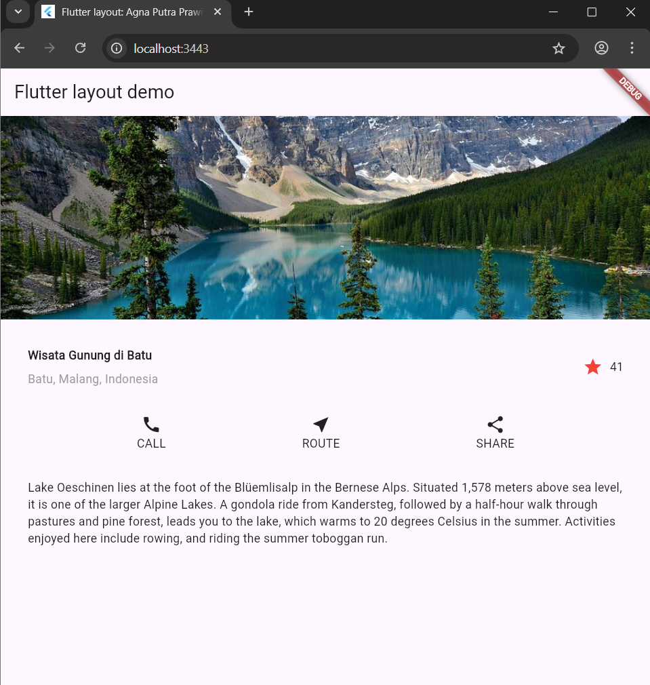

## Practical 2: Implementation of button row
Complete the following practical steps by continuing from the previous practical.

### Step 1: Create a Column _buildButtonColumn method
The button section contains three columns that use the same layout—an icon above a line of text. The columns in this row are evenly spaced, and the text and icon are in primary colors.

Since the code to build each column is nearly identical, create a private helper method named buildButtonColumn(), which has parameters color, Iconand Text, so it can return a column with its widgets corresponding to a specific color.

lib/main.dart(_buildButtonColumn)
```dart:
class MyApp extends StatelessWidget {
  const MyApp({super.key});

  @override
  Widget build(BuildContext context) {
    // ···
  }

  Column _buildButtonColumn(Color color, IconData icon, String label) {
    return Column(
      mainAxisSize: MainAxisSize.min,
      mainAxisAlignment: MainAxisAlignment.center,
      children: [
        Icon(icon, color: color),
        Container(
          margin: const EdgeInsets.only(top: 8),
          child: Text(
            label,
            style: TextStyle(
              fontSize: 12,
              fontWeight: FontWeight.w400,
              color: color,
            ),
          ),
        ),
      ],
    );
  }
}
```
Output:
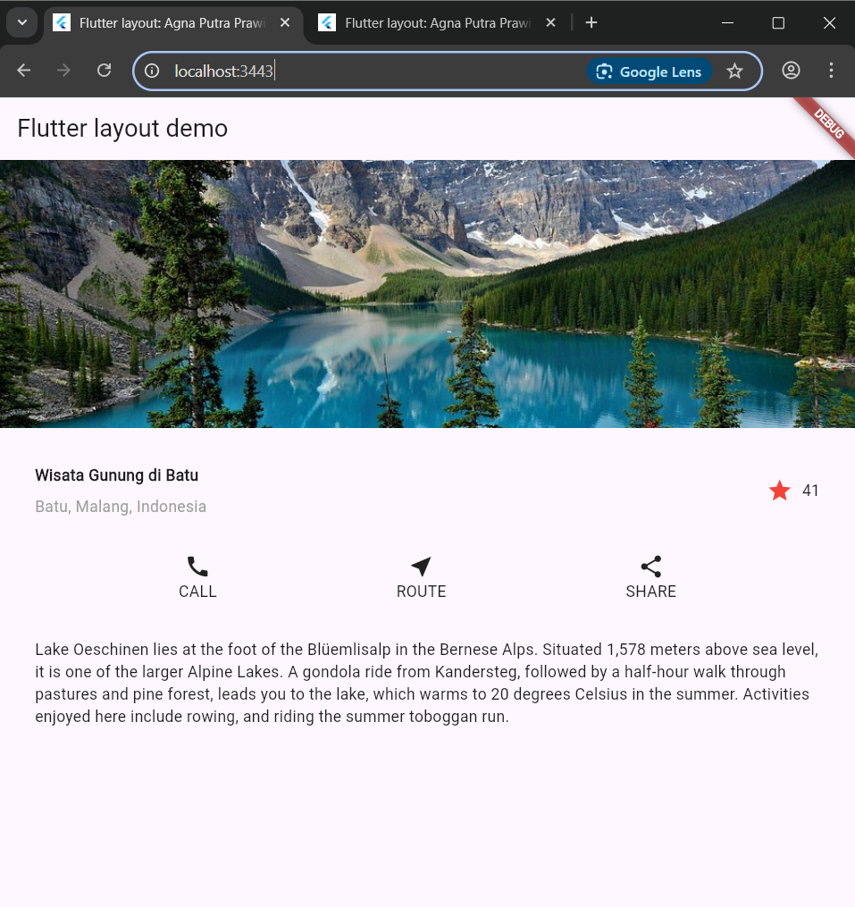

### Step 2: Create a buttonSection widget
Create a function to add an icon directly to the column. The text is inside Containerwith a margin only at the top, separating the text from the icon.

Create a row containing these columns by calling a function and assigning Iconcustom colors, , and text to the columns through parameters. Align the columns along the main axis using MainAxisAlignment.spaceEvenlyto evenly space before, between, and after each column. Add the following code directly below the declaration titleSectioninside the method build():

lib/main.dart (buttonSection)
```dart:
Color color = Theme.of(context).primaryColor;

Widget buttonSection = Row(
  mainAxisAlignment: MainAxisAlignment.spaceEvenly,
  children: [
    _buildButtonColumn(color, Icons.call, 'CALL'),
    _buildButtonColumn(color, Icons.near_me, 'ROUTE'),
    _buildButtonColumn(color, Icons.share, 'SHARE'),
  ],
);
```
Output:
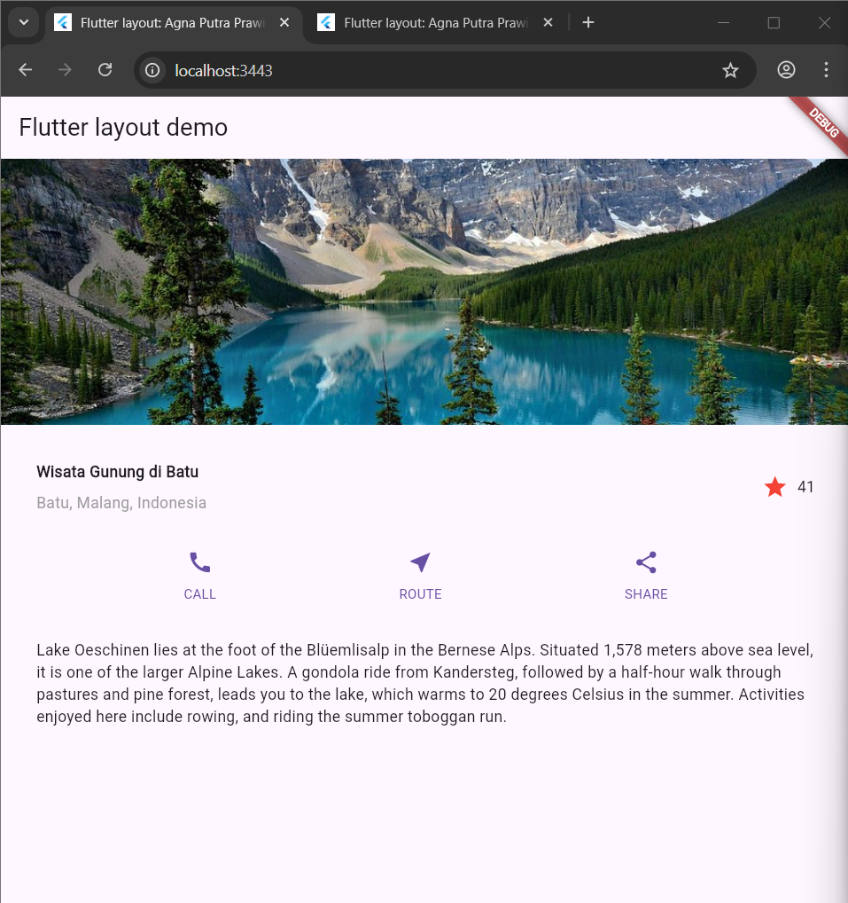

### Step 3: Add a button section to the body
Add variables buttonSectionto it bodylike this:
```dart:
    // 🔹 Step 3: buttonSection sudah dimasukkan ke body
    return MaterialApp(
      title: 'Flutter layout: Agna Putra Prawira (2341720065)',
      home: Scaffold(
        appBar: AppBar(
          title: const Text('Flutter layout demo'),
        ),
        body: ListView(
          children: [
            imageSection,
            titleSection,
            buttonSection,
            textSection,
          ],
        ),
      ),
    );
```
Output:


## Practical 3: Implementation of text section
Complete the following practical steps by continuing from the previous practical.

### Step 1: Create a textSection widget
Define a text field as a variable. Enter the text inside Containerand add padding along each edge. Add the following code directly below the declaration buttonSection:
```Dart:
    // 🔹 Text Section (Praktikum 3 Step 1)
    Widget textSection = Container(
      padding: const EdgeInsets.all(32),
      child: const Text(
        'Coban Rondo is a popular natural destination located in Pujon District, '
        'Malang Regency, East Java. The area is best known for its impressive '
        '84-meter-tall waterfall, which holds a local legend about a princess who '
        'became a widow. In addition to the stunning cascade, visitors can enjoy a '
        'variety of activities, including navigating the fun Labyrinth Park, trying '
        'outdoor adventures, or simply relaxing in the serene pine forest. With its '
        'combination of natural beauty and recreational facilities, Coban Rondo offers '
        'a perfect getaway for both families and adventure seekers.\n\n'
        'Agna Putra Prawira - 2341720065',
      ),
    );
```
By setting the value softWrap= true, the line of text will fill the width of the column before wrapping at the word boundary.

### Step 2: Add text section variable to body
Add a variable widget textSectionto it bodylike this:
```dart:
        body: ListView(
          children: [
            imageSection,
            titleSection,
            buttonSection,
            textSection, // <--- ditambahkan
```
Output:
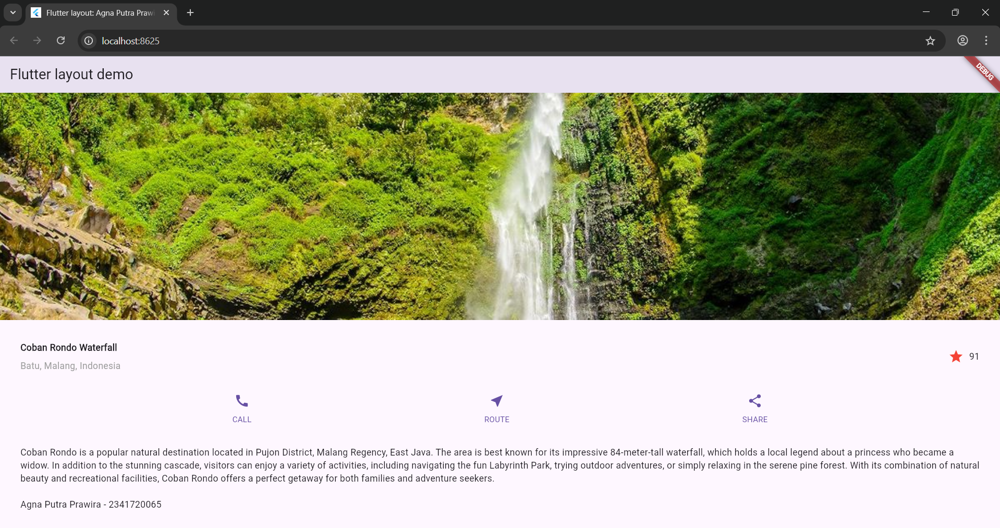

## Practical 4: Implementation of image section
Complete the following practical steps by continuing from the previous practical.

### Step 1: Prepare image assets
You can search for images online that you want to display. Create a folder imagesin the root of your layout_flutter project . Place the image files in the folder images, then set the filename to something pubspec.yamllike this:


An example of the image file name above islake.jpg

Tips

- Note that it pubspec.yamlis case sensitive, so write assets: and the image URL as shown above.
- Pubspec files are also whitespace sensitive, so use proper indentation.
- You may need to restart any running programs (either on the simulator or a connected device) for the pubspec changes to take effect.

### Step 2: Add image to body
Add image assets to it bodyas follows:
```dart:
  Widget build(BuildContext context) {
    // 🔹 Image Section
    Widget imageSection = Image.asset(
      'images/lake.jpg',
      width: 800,
      height: 400,
      fit: BoxFit.cover,
    );
```
BoxFit.covertells the framework that the image should be as small as possible but cover its entire render box.

### Step 3: Finally, convert it to ListView
In this final step, set all elements in ListView, not Column, because ListViewit supports dynamic scrolling when the application is run on devices with smaller resolutions.
```dart:
   return MaterialApp(
      title: 'Flutter layout: Agna Putra Prawira (2341720065)',
      home: Scaffold(
        appBar: AppBar(
          title: const Text('Flutter layout demo'),
        ),
        body: ListView( //<--- add this
          children: [
```
Output:
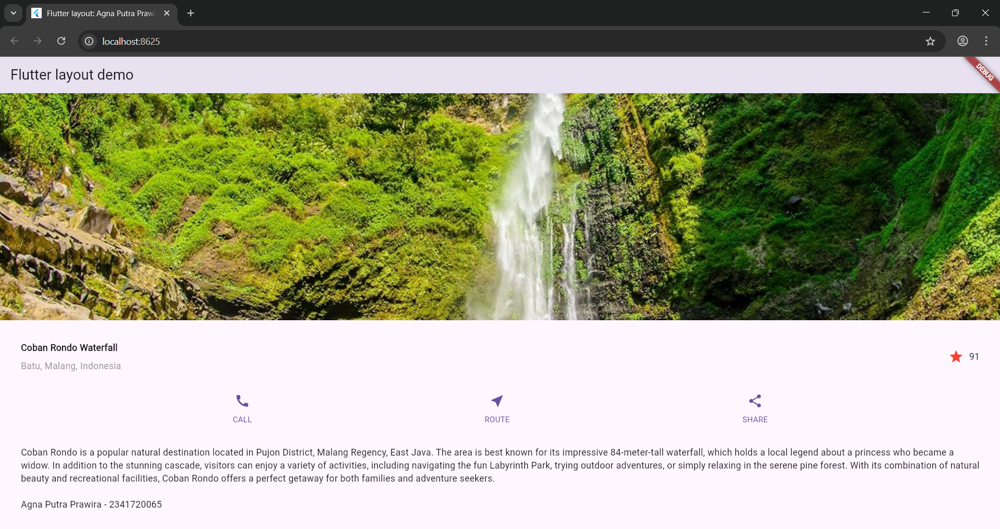

## 7. Tugas Praktikum 1
  1. Selesaikan Praktikum 1 sampai 4, lalu dokumentasikan dan push ke repository Anda berupa screenshot setiap hasil pekerjaan beserta penjelasannya di file README.md!
  2. Silakan implementasikan di project baru "basic_layout_flutter" dengan mengakses sumber ini: https://docs.flutter.dev/codelabs/layout-basics
  3. Kumpulkan link commit repository GitHub Anda kepada dosen yang telah disepakati!

ANSWER
  1. I have made the report above.
  2. I have implemented it appropriately in my practicum.
  3. 


## Lab 5: Building Navigation in Flutter

### Step 1: Prepare a new project
Before continuing with the practical, create a new Flutter project named "shopping" and arrange the folders as shown in the following image. This arrangement is intended to facilitate code and widget organization.
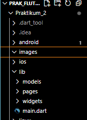

### Step 2: Defining Routes
Create two Dart files named <div> home_page.dartand <div> item_page.dartin the pages folder . For each file, declare <div> class HomePagein <div> home_page.dartand ItemPage<div> in <div> item_page.dart. Subtract the class <div> from StatelessWidget<div>. The following code snippet illustrates this.

home_page.dart:
```dart:
import 'package:flutter/material.dart';

class HomePage extends StatelessWidget {
  const HomePage({super.key});

  @override
  Widget build(BuildContext context) {
    return Scaffold(
      appBar: AppBar(
        title: const Text('Home Page'),
      ),
      body: const Center(
        child: Text('Welcome to the Home Page!'),
      ),
    );
  }
}
```

item_page.dart:
```dart:
import 'package:flutter/material.dart';

class ItemPage extends StatelessWidget {
  const ItemPage({super.key});

  @override
  Widget build(BuildContext context) {
    return Scaffold(
      appBar: AppBar(
        title: const Text('Item Page'),
      ),
      body: const Center(
        child: Text('This is the Item Detail Page'),
      ),
    );
  }
}
```

### Step 3: Complete the Code inmain.dart
Once both pages have been created and defined, open the main.dart. In this step, you will define routes for both pages. Route names must be unique . The HomePage is defined as / . And the ItemPage is defined as /item . To define the home page, you can use named argument initialRoute. You can see an overview of these steps in the following code snippet

main.dart:
```dart:
import 'package:flutter/material.dart';
import 'pages/homepage.dart';
import 'pages/itempage.dart';

void main() {
  runApp(MyApp());
}

class MyApp extends StatelessWidget {
  @override
  Widget build(BuildContext context) {
    return MaterialApp(
      title: 'Praktikum Navigation',
      initialRoute: '/',
      routes: {
        '/': (context) => HomePage(),
        '/item': (context) => ItemPage(),
      },
    );
  }
}
```

### Step 4: Create a data model
Before moving from page to HomePagepage ItemPage, a data modeling process is required. In the mockup design, two pieces of information are needed: name and price. To handle this, create a file named item.dartand place it in the models folder . This file defines the required data modeling. An illustration of the required code can be seen in the following code snippet.
item.dart:
```dart
class Item {
  String name;
  int price;

  Item({required this.name, required this.price});
}
```

### Step 5: Complete the code in the classHomePage
The page HomePagecontains ListViewa widget. The data source ListViewis taken from the List model of the Item object. An overview of the code required to define the model can be seen below
homepage.dart:
```dart:
import 'package:flutter/material.dart';
import '../models/item.dart';

class HomePage extends StatelessWidget {
  final List<Item> items = [
    Item(name: 'Indomie Goreng', price: 3000),
    Item(name: 'Mie Sedaap', price: 2500),
    Item(name: 'Sugar', price: 5000),
    Item(name: 'Salt', price: 2000),
  ];

  @override
  Widget build(BuildContext context) {
    return Scaffold(
      appBar: AppBar(
        title: Text('Daftar Barang'),
      ),
      body: ListView.builder(
        itemCount: items.length,
        itemBuilder: (context, index) {
          final item = items[index];
          return Card(
            child: ListTile(
              title: Text(item.name),
              subtitle: Text('Harga: Rp ${item.price}'),
            ),
          );
        },
      ),
    );
  }
}
```


### Step 6: Creating ListView and itemBuilder
The <data> widget is used to display the data ListViewin this lab itemBuilder. Data is taken from the previously created model definition. The <data> widget is used to show the boundaries of one data point and the next Card. The code used in this section is not shown. An overview of the required code can be seen below.

```dart:
 @override
  Widget build(BuildContext context) {
    return Scaffold(
      appBar: AppBar(
        title: Text('Daftar Barang'),
      ),
      body: ListView.builder(
        itemCount: items.length,
        itemBuilder: (context, index) {
          final item = items[index];
          return Card(
            child: ListTile(
              title: Text(item.name),
              subtitle: Text('Harga: Rp ${item.price}'),
            ),
          );
        },
      ),
    );
  }
}
```
### Run the application on the emulator or on your device.
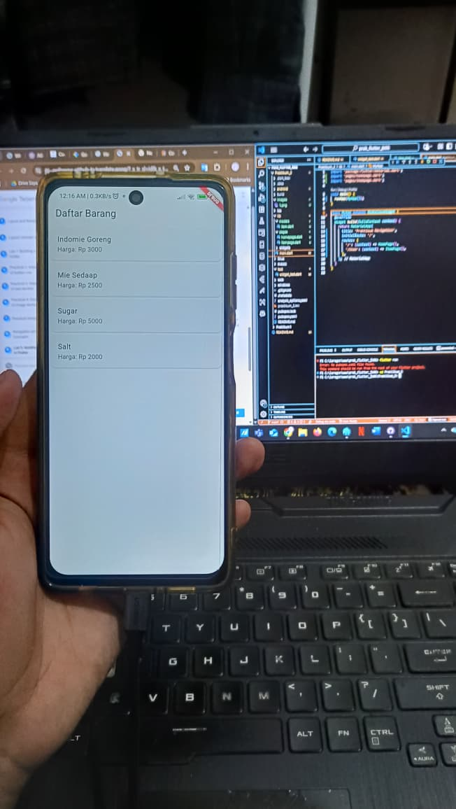

### Step 7: Adding actions toListView
Items in the ListView currently don't provide any specific action when pressed. To add actions to a ListView, you can use the InkWellor widget GestureDetector. The main difference InkWellis that the material widget provides an effect when pressed. The GestureDetectoris more general and can also be used for gestures other than touch. In this practical, the widget will be used InkWell.

To add a touch, place the cursor on the opening widget Card. Then use the VSCode quick fix shortcut ( Ctrl + . on Windows or Cmd + . on macOS). Highlight wrap with widget...the Change widget value to menu InkWelland add a named argument onTapcontaining the function to navigate to the page ItemPage. You can see an illustration of the code snippet in the following snippet.
```dart:
import 'package:flutter/material.dart';
import '../models/item.dart';
import 'itempage.dart';

class HomePage extends StatelessWidget {
  // Membuat daftar item
  final List<Item> items = [
    Item(name: 'Apple', price: 10000),
    Item(name: 'Banana', price: 5000),
    Item(name: 'Orange', price: 8000),
    Item(name: 'Sugar', price: 5000),
    Item(name: 'Salt', price: 2000),
  ];

  @override
  Widget build(BuildContext context) {
    return Scaffold(
      appBar: AppBar(
        title: const Text('Shopping List'),
        backgroundColor: Colors.green,
      ),
      body: ListView.builder(
        itemCount: items.length,
        itemBuilder: (context, index) {
          final item = items[index];
          return Card(
            child: InkWell(   // 🔹 Langkah 7: Tambah aksi klik
              onTap: () {
                Navigator.pushNamed(
                  context,
                  '/item',
                  arguments: item, // kirim data ke halaman item
                );
              },
              child: ListTile(
                title: Text(item.name),
                subtitle: Text('Rp ${item.price}'),
              ),
            ),
          );
        },
      ),
    );
  }
}
```

Run the application again and make sure the ListView can be touched and moves to the next page. Check again if there are errors.
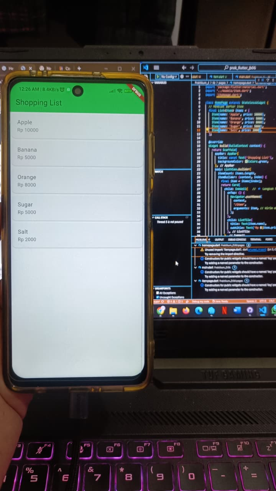


## Practical Assignment 2
1. To send data to the next page, simply add arguments information to the usage Navigator. Update the code in the section Navigatorto look like this.
Navigator.pushNamed(context, '/item', arguments: item);
```dart:
                Navigator.pushNamed(
                  context,
                  '/item',
                  arguments: item, // kirim data ke halaman item
                );
```
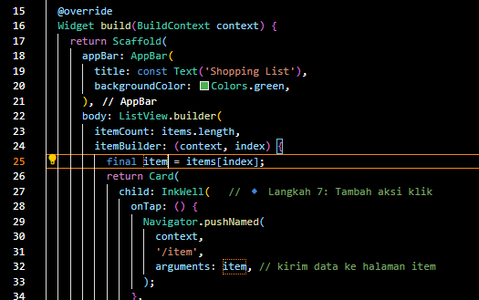

2. Reading the value passed on the previous page can be done using ModalRoute. Add the following code to the build function block in the page ItemPage. Once the value is retrieved, you can use it like any other variable. ( https://docs.flutter.dev/cookbook/navigation/navigate-with-arguments )
final itemArgs = ModalRoute.of(context)!.settings.arguments as Item;
productcard.dart:
```dart:
import 'package:flutter/material.dart';
import '../models/item.dart';

class ItemPage extends StatelessWidget {
  @override
  Widget build(BuildContext context) {
    // 🔹 Langkah 2: Ambil data dari halaman sebelumnya
    final itemArgs = ModalRoute.of(context)!.settings.arguments as Item;

    return Scaffold(
      appBar: AppBar(
        title: Text(itemArgs.name),
        backgroundColor: Colors.green,
      ),
      body: Padding(
        padding: const EdgeInsets.all(16.0),
        child: Column(
          crossAxisAlignment: CrossAxisAlignment.start,
          children: [
            // Gambar produk (bisa diganti sesuai keinginan)
            Center(
              child: Image.asset(
                'assets/images/${itemArgs.name.toLowerCase()}.png',
                height: 200,
              ),
            ),
            const SizedBox(height: 20),

            // Nama produk
            Text(
              itemArgs.name,
              style: const TextStyle(
                fontSize: 24,
                fontWeight: FontWeight.bold,
              ),
            ),

            const SizedBox(height: 10),

            // Harga produk
            Text(
              'Harga: Rp ${itemArgs.price}',
              style: const TextStyle(fontSize: 18),
            ),
          ],
        ),
      ),
    );
  }
}

```


3. In the final version of your completed shoppingGridView app, add product photos, stock, and ratings. Change the appearance to resemble a typical marketplace app.

homepage.dart:
```dart:
import 'package:flutter/material.dart';
import '../models/item.dart';
import 'itempage.dart';

class HomePage extends StatelessWidget {
  final List<Item> items = [
    Item(name: 'Apple', price: 10000, stock: 20, rating: 4.5, image: 'assets/images/apple.png'),
    Item(name: 'Banana', price: 5000, stock: 35, rating: 4.2, image: 'assets/images/banana.png'),
    Item(name: 'Orange', price: 8000, stock: 18, rating: 4.7, image: 'assets/images/orange.png'),
    Item(name: 'Sugar', price: 5000, stock: 50, rating: 4.4, image: 'assets/images/sugar.png'),
    Item(name: 'Salt', price: 2000, stock: 100, rating: 4.1, image: 'assets/images/salt.png'),
  ];

  @override
  Widget build(BuildContext context) {
    return Scaffold(
      appBar: AppBar(
        title: const Text('Marketplace'),
        backgroundColor: Colors.green,
      ),
      body: Padding(
        padding: const EdgeInsets.all(8.0),
        child: GridView.builder(
          itemCount: items.length,
          gridDelegate: const SliverGridDelegateWithFixedCrossAxisCount(
            crossAxisCount: 2, // dua kolom
            childAspectRatio: 0.75,
            crossAxisSpacing: 10,
            mainAxisSpacing: 10,
          ),
          itemBuilder: (context, index) {
            final item = items[index];
            return Card(
              shape: RoundedRectangleBorder(borderRadius: BorderRadius.circular(12)),
              elevation: 4,
              child: InkWell(
                onTap: () {
                  Navigator.pushNamed(context, '/item', arguments: item);
                },
                child: Column(
                  crossAxisAlignment: CrossAxisAlignment.start,
                  children: [
                    // Gambar produk
                    Expanded(
                      child: ClipRRect(
                        borderRadius: const BorderRadius.only(
                          topLeft: Radius.circular(12),
                          topRight: Radius.circular(12),
                        ),
                        child: Image.asset(
                          item.image,
                          fit: BoxFit.cover,
                          width: double.infinity,
                        ),
                      ),
                    ),
                    Padding(
                      padding: const EdgeInsets.all(8.0),
                      child: Column(
                        crossAxisAlignment: CrossAxisAlignment.start,
                        children: [
                          Text(item.name, style: const TextStyle(fontWeight: FontWeight.bold)),
                          Text('Rp ${item.price}', style: const TextStyle(color: Colors.green)),
                          Text('Stock: ${item.stock}'),
                          Row(
                            children: [
                              const Icon(Icons.star, size: 16, color: Colors.orange),
                              Text(item.rating.toString()),
                            ],
                          ),
                        ],
                      ),
                    ),
                  ],
                ),
              ),
            );
          },
        ),
      ),
    );
  }
}
```
item.dart:
```dart
class Item {
  final String name;
  final int price;
  final int stock;
  final double rating;
  final String image;

  Item({
    required this.name,
    required this.price,
    required this.stock,
    required this.rating,
    required this.image,
  });
}

```

4. Please implement it Hero widgetin your shopping app by learning from this resource: https://docs.flutter.dev/cookbook/navigation/hero-animations

homepage.dart:
```dart:
import 'package:flutter/material.dart';
import '../models/item.dart';

class HomePage extends StatelessWidget {
  final List<Item> items = [
    Item(
      name: 'Apple',
      price: 10000,
      stock: 20,
      rating: 4.5,
      image: 'assets/images/apple.png',
    ),
    Item(
      name: 'Banana',
      price: 5000,
      stock: 30,
      rating: 4.0,
      image: 'assets/images/banana.png',
    ),
    Item(
      name: 'Orange',
      price: 8000,
      stock: 15,
      rating: 4.2,
      image: 'assets/images/orange.png',
    ),
  ];

  @override
  Widget build(BuildContext context) {
    return Scaffold(
      appBar: AppBar(
        title: const Text('Shopping List'),
        backgroundColor: Colors.green,
      ),
      body: ListView.builder(
        itemCount: items.length,
        itemBuilder: (context, index) {
          final item = items[index];
          return Card(
            child: InkWell(
              onTap: () {
                Navigator.pushNamed(
                  context,
                  '/item',
                  arguments: item,
                );
              },
              child: ListTile(
                leading: Hero(
                  tag: item.name, // Hero tag harus unik per item
                  child: Image.asset(
                    item.image,
                    width: 50,
                    height: 50,
                    fit: BoxFit.cover,
                  ),
                ),
                title: Text(item.name),
                subtitle: Text('Rp ${item.price}'),
                trailing: Icon(Icons.arrow_forward_ios, size: 16),
              ),
            ),
          );
        },
      ),
    );
  }
}
```
itempage.dart:
```dart:
import 'package:flutter/material.dart';
import '../models/item.dart';

class ItemPage extends StatelessWidget {
  @override
  Widget build(BuildContext context) {
    final itemArgs = ModalRoute.of(context)!.settings.arguments as Item;

    return Scaffold(
      appBar: AppBar(
        title: Text(itemArgs.name),
        backgroundColor: Colors.green,
      ),
      body: Padding(
        padding: const EdgeInsets.all(16.0),
        child: Column(
          crossAxisAlignment: CrossAxisAlignment.start,
          children: [
            Center(
              child: Hero(
                tag: itemArgs.name,
                child: Image.asset(
                  itemArgs.image,
                  width: 200,
                  height: 200,
                  fit: BoxFit.cover,
                ),
              ),
            ),
            const SizedBox(height: 20),
            Text(
              itemArgs.name,
              style: const TextStyle(
                  fontSize: 24, fontWeight: FontWeight.bold),
            ),
            Text('Price: Rp ${itemArgs.price}'),
            Text('Stock: ${itemArgs.stock} pcs'),
            Row(
              children: [
                const Icon(Icons.star, color: Colors.orange, size: 20),
                const SizedBox(width: 4),
                Text('${itemArgs.rating} / 5.0'),
              ],
            ),
            const Spacer(),
            const Center(
              child: Text(
                'Agna Putra Prawira (2341720065)',
                style: TextStyle(fontSize: 14, color: Colors.grey),
              ),
            ),
          ],
        ),
      ),
    );
  }
}
```


5. Customize and modify the appearance to create an attractive app. Additionally, break down widgets into smaller pieces of code. Add your name and student ID number to the footer of your shopping app .
itemcard.dart
```dart:
import 'package:flutter/material.dart';
import '../models/item.dart';

class ItemCard extends StatelessWidget {
  final Item item;
  final VoidCallback onTap;

  const ItemCard({Key? key, required this.item, required this.onTap})
      : super(key: key);

  @override
  Widget build(BuildContext context) {
    return GestureDetector(
      onTap: onTap,
      child: Card(
        elevation: 4,
        shape: RoundedRectangleBorder(borderRadius: BorderRadius.circular(12)),
        child: Column(
          crossAxisAlignment: CrossAxisAlignment.start,
          children: [
            Hero(
              tag: item.name,
              child: ClipRRect(
                borderRadius:
                    const BorderRadius.vertical(top: Radius.circular(12)),
                child: Image.asset(
                  item.image,
                  height: 120,
                  width: double.infinity,
                  fit: BoxFit.cover,
                ),
              ),
            ),
            Padding(
              padding: const EdgeInsets.all(8.0),
              child: Column(
                crossAxisAlignment: CrossAxisAlignment.start,
                children: [
                  Text(
                    item.name,
                    style: const TextStyle(
                        fontSize: 16, fontWeight: FontWeight.bold),
                  ),
                  Text(
                    'Rp ${item.price}',
                    style: const TextStyle(color: Colors.green),
                  ),
                  Text('Stock: ${item.stock}'),
                  Row(
                    children: [
                      const Icon(Icons.star,
                          color: Colors.orange, size: 16),
                      const SizedBox(width: 4),
                      Text('${item.rating}'),
                    ],
                  ),
                ],
              ),
            ),
          ],
        ),
      ),
    );
  }
}
```

6. Complete Practical 5: Navigation and Routes. Try modifying it using the go_router plugin , then document and push it to your repository in the form of screenshots of each work result along with explanations in the file README.md.. Submit the commit link for your GitHub repository to the agreed-upon lecturer!

main.dart:
```dart:
import 'package:flutter/material.dart';
import 'package:go_router/go_router.dart';
import 'models/item.dart';
import 'pages/homepage.dart';
import 'pages/itempage.dart';

void main() {
  runApp(MyApp());
}

class MyApp extends StatelessWidget {
  MyApp({super.key});

  // 🔹 Definisikan router menggunakan go_router
  final GoRouter _router = GoRouter(
    initialLocation: '/',
    routes: [
      GoRoute(
        path: '/',
        builder: (context, state) => HomePage(),
      ),
      GoRoute(
        path: '/item',
        builder: (context, state) {
          // Ambil data item dari query parameter
          final item = state.extra as Item;
          return ItemPage(item: item);
        },
      ),
    ],
  );

  @override
  Widget build(BuildContext context) {
    return MaterialApp.router(
      debugShowCheckedModeBanner: false,
      title: 'Flutter Marketplace',
      theme: ThemeData(
        primarySwatch: Colors.green,
      ),
      routerConfig: _router,
    );
  }
}
```

pubspec.yaml:
```dart:
dependencies:
  flutter:
    sdk: flutter
  
  go_router: ^14.0.0


  # The following adds the Cupertino Icons font to your application.
  # Use with the CupertinoIcons class for iOS style icons.
  cupertino_icons: ^1.0.8
  ```

Output:
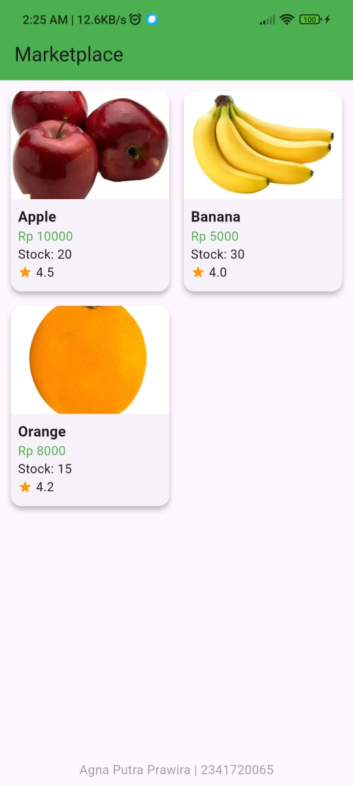

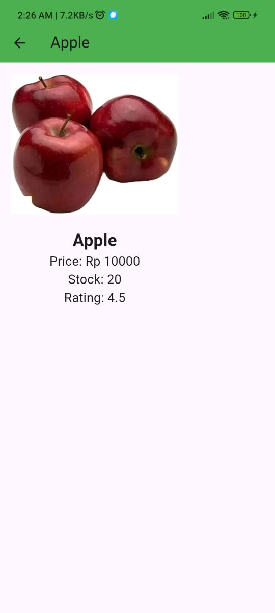

- i have done push on github
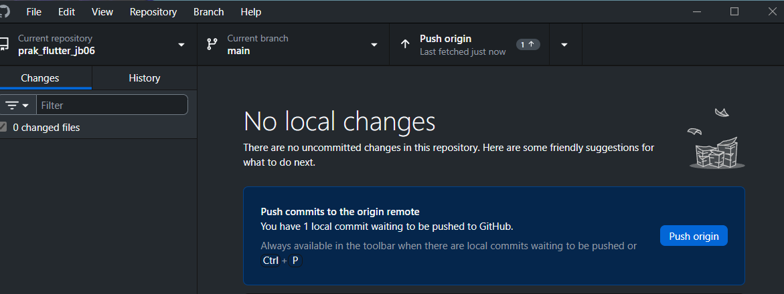